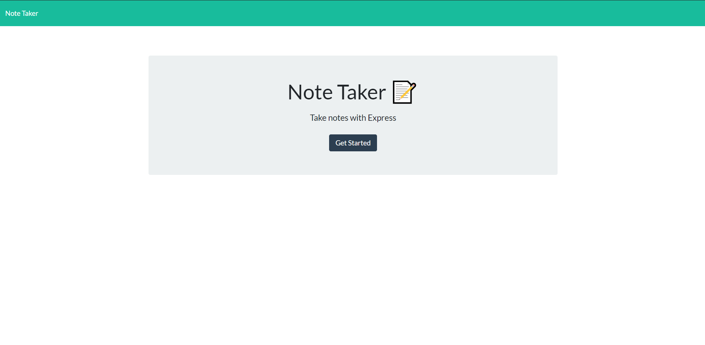
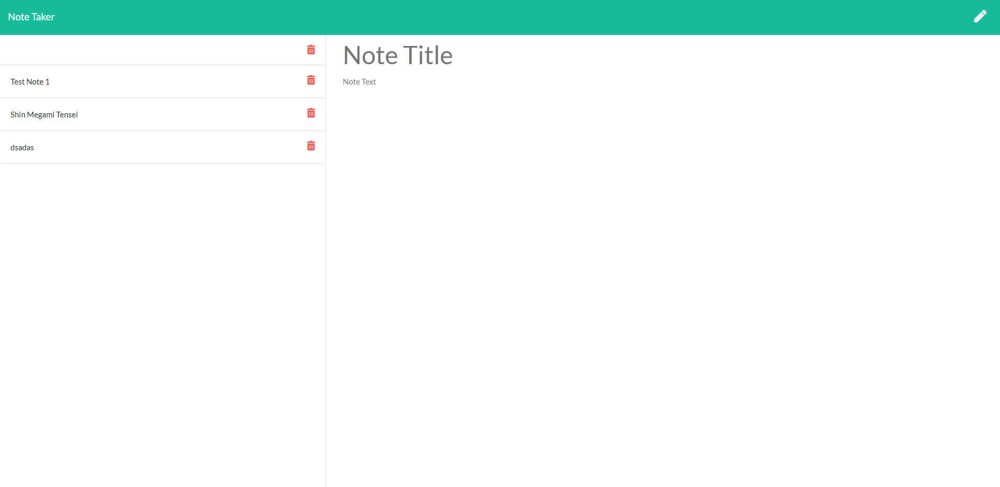

# **Note-Taker**

## **Description**
This application was created so that the user may create and modify notes within the app. While running express.js in the back-end, the functionality of this app allows the user to create a new note by simple entering a title and body text. Remeber to add both as they are required for the save button to appear.

## Screenshots

## **Table of Contents**

* [Usage](#Usage)

* [Deployed Application](#Deployed-Application)

* [Credits](#Credits)

* [Questions](#Questions)

## **Usage**
Create notes by simply clicking into the text area of the title or body. Clicking the pen at the top right corner will also start the creation of a new note. Once title and body created, save icon should appear.

## Deployed-Application
https://note-taker213.herokuapp.com/

## Credits
Created By Jesus Molina(⌐■_■).

## Questions
Have Questions? Need Answers? Feel free to reachout out to me on [GitHub](https://github.com/Kos-MosV4). Contact me on my email: JesusM1948@gmail.com
